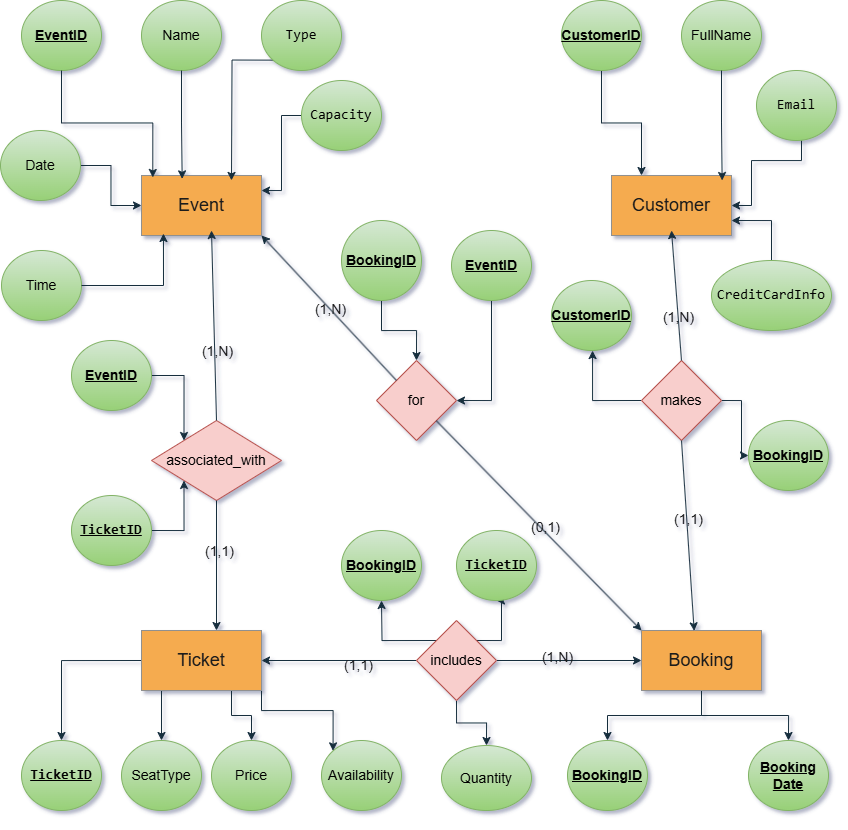

# HY360 - Files and Databases Project

This repository is created for the **HY360** course project, which focuses on **Files and Databases**. The project involves working with various concepts related to database management, file handling, and data structures.

## Contributors
- **Dimitrios Makrogiannis**
- **Gerasimos Efthimioy**
- **Dimitrios Vidalis**

## Project Description
This project aims to demonstrate the practical application of the concepts learned in the HY360 course, including database creation, table relationships, and file operations.

## Project Model
The following picture demonstrates the project model, which includes the database schema and the file structure.

## Project Structure
The project is structured as the Professor's instructions. See the [Project Structure](docs/ΗΥ360_project_2024.pdf) file for more details.
## License
This project is owned by Dimitrios Makrogiannis csd4676 aka PercySS.
