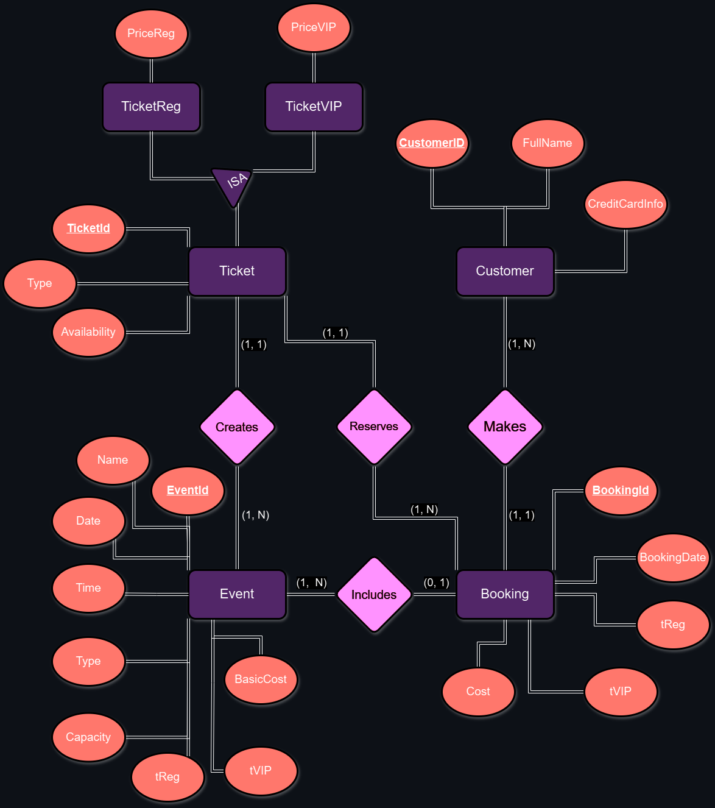

# HY360 - Files and Databases Project

This repository is created for the **HY360** course project, which focuses on **Files and Databases**. The project involves working with various concepts related to database management, file handling, and data structures.

## Contributors
- **Dimitrios Makrogiannis**

## Project Description
This project aims to demonstrate the practical application of the concepts learned in the HY360 course, including database creation, table relationships, and file operations.

## Project Model
The following picture demonstrates the project model, which includes the database schema and the file structure.


## Project Structure
The project is structured as the Professor's instructions. See [Project Structure](docs/ΗΥ360_project_2024.pdf) for more details.

## Project report
You can find the project report [here](docs/project_report_team1.pdf) .


## To Run the project
To run the project, you need to have the following installed:
- IntelliJ IDEA (community edition). 
- Java 1.8 or higher.
- The driver for the database (included in the project) download it [here](https://dev.mysql.com/downloads/connector/j/?os=26).
- XAMPP download it [here](https://www.apachefriends.org/download.html).
- --- 

1. **Clone the repository**:
    ```bash
    git clone https://github.com/PercySS/HY360_project.git
    ```
2. **Open as project in IntelliJ IDEA**:

3. **Start the MySQL server**:
    - Start the MySQL server (XAMPP) as admin and Start Apache and MySQL.
   

   **Steps**
   ```markdown
    - Open the XAMPP Control Panel.
    - Start the Apache and MySQL services.
    - Run the project in IntelliJ IDEA.
    - You only need to put customers, events, and make the bookings.
    - The project will do the rest.
    - The Graphical User Interface will drive you through the process.
    - Enjoy!
   ```

## License
This project is owned by Dimitrios Makrogiannis csd4676 aka [PercySS](https://github.com/PercySS).
